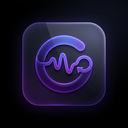

<div align="center">
  

  # GnzaSync
  
  **Traducción Universal en Tiempo Real para Transmisiones y Video**

  [](https://tauri.app/)
  [](https://react.dev/)
  [](https://vitejs.dev/)
  [](https://tailwindcss.com/)
  [](https://python.org/)

</div>

---

**GnzaSync** es una herramienta profesional, rápida y optimizada de traducción universal en tiempo real para PC. Diseñada específicamente para traducir transmisiones en vivo (Twitch, Kick, YouTube) y videos de forma automática mediante un overlay nativo de alto rendimiento.

<div align="center">
  
</div>

## ✨ Características Principales

### ⚙️ Motor de Inteligencia Artificial (Backend Python)
- 🎧 **Captura de Sistema (Loopback):** Captura directamente el audio interno de tu PC. Es decir, "escucha" exactamente lo mismo que tú estás escuchando, sin configuraciones complejas de audio virtual.
- 🎙️ **Detección Inteligente de Silencios (VAD):** La Inteligencia Artificial analiza el audio estrictamente cuando detecta voz humana, reduciendo drásticamente el uso de CPU y GPU.
- 🚀 **IA Local y Privada (Offline):** Transcripción instantánea impulsada por **Faster-Whisper** aprovechando la aceleración de hardware, y traducción ultra rápida con **Argos Translate**. Ningún dato viaja a servidores externos.

### 🎨 Interfaz de Usuario (Frontend React + Tauri)
- 💎 **Diseño Premium:** Interfaz moderna "Glassmorphism" con fondos oscuros, acentos neón y una paleta de colores cuidadosamente seleccionada para la vista.
- 📺 **Overlay Dinámico (PIP):** Ventana flotante transparente, optimizada para hardware, que proyecta los subtítulos por encima de cualquier otra aplicación o navegador de manera fluida y sin interrupciones.
- 🎛️ **Panel de Control Avanzado:**
  - **Selector de Motor IA:** Ajusta el balance entre velocidad y precisión en caliente (Modelos Tiny, Base, Small).
  - **Personalización Visual:** Ajustes en tiempo real para la opacidad del fondo, tamaño de la fuente tipográfica y alineación del texto en el Overlay.
  - **Monitor Integrado:** Visualización en vivo del uso de recursos del sistema (CPU / IA).
  - **Atajos Globales:** Control rápido con combinaciones de teclas (ej. `⌘ ⇧ S` para atajo rápido).

## 🛠️ Stack Tecnológico

El proyecto utiliza una arquitectura moderna de escritorio separando el frontend de alto rendimiento del backend pesado de IA.

- **Aplicación Core:** Tauri v2 (Rust)
- **Frontend UI:** React 19, TypeScript, Vite 8, Tailwind CSS v4, Zustand.
- **Backend IA:** Python (Faster-Whisper, Argos Translate, PyAudio).

## 🚀 Requisitos de Instalación

1. **Dependencias del Sistema:**
   - Node.js (v20 o superior).
   - Rust (última versión estable).
   - Python 3.10 o superior (con `pip` instalado).

2. **Clonar y Configurar:**
   ```bash
   git clone https://github.com/GnzaDev/GnzaSync.git
   cd GnzaSync
   npm install
   ```

3. **Ejecución en Desarrollo:**
   ```bash
   npm run tauri dev
   ```

4. **Compilación de Producción:**
   ```bash
   npm run tauri build
   ```
   *El ejecutable resultante estará en `src-tauri/target/release/bundle/nsis/`.*

## 📄 Licencia

Este proyecto está distribuido bajo la licencia MIT.
Copyright © Gnza. Todos los derechos reservados.
